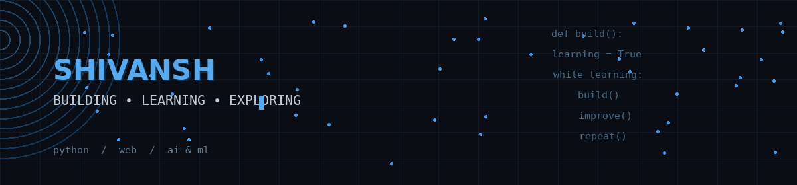

 

---

## About me

I'm a B.Tech CSE student who's always been interested in technology and curious about learning how new things work.

Right now, I'm learning Python and gradually moving towards web development, AI, and machine learning. I like experimenting with different technologies, building things, and understanding what's actually happening behind the code.

## How I learn

Most of the time, I learn by building something and figuring things out along the way. I don't always get it right on the first try, but getting stuck is usually where I end up learning the most.

I'm trying to focus on understanding the concepts behind what I'm building instead of just getting something to work. AI and other tools are useful, but I want to understand what I'm building and be able to work on it myself.

## What I'm working on

At the moment, I'm spending most of my time with Python and getting more comfortable with building actual projects.

I'm gradually moving towards web development and exploring AI and machine learning along the way. I'm also working on DSA and trying to improve my problem-solving skills.

Most of my learning comes from actually building something, getting stuck somewhere, figuring out what's wrong, and trying again.

## Currently learning

  

  <b>Python → Web Development → AI & Machine Learning</b>

 

## Projects

<table>
<tr>

<td width="50%" valign="top">

<h3>⚖️ LegalVault</h3>

A blockchain-based platform for managing legal documents, with AI-assisted document analysis.

<b>Tech:</b>

<code>Hardhat</code>

</td>

<td width="50%" valign="top">

<h3>🧠 AI College Project Doctor</h3>

A project I'm developing to use AI to analyze college projects and provide useful feedback on their implementation, architecture, and overall quality.

<b>Tech:</b>

<code>AI / LLMs</code>

</td>

</tr>
</table>

 

## Technologies I'm exploring

 

## What I'm trying to improve

<table>
<tr>

<td align="center" width="25%">

### 🧠
**Problem Solving**

</td>

<td align="center" width="25%">

### 💻
**Programming**

</td>

<td align="center" width="25%">

### 🧩
**DSA**

</td>

<td align="center" width="25%">

### 🚀
**Building Projects**

</td>

</tr>
</table>

I'm also trying to become better at understanding the fundamentals instead of constantly jumping from one technology to another.

## A bit more

I enjoy learning about new technologies, but I'm also trying to get better at the fundamentals behind them.

I don't have everything figured out yet. I'm learning, building, making mistakes, understanding why things break, and trying to improve with every project.

---

### Building things, breaking things, understanding why, and trying again.

 

